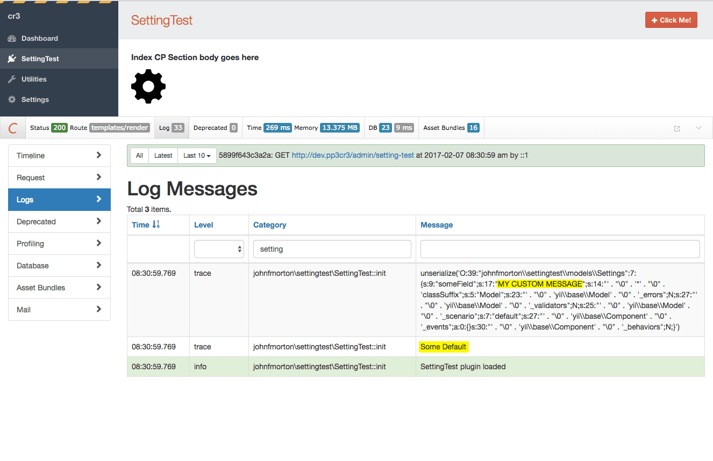

# craft3settingsTestPlugin

This is only to demonstrate unexpected behavior when using settings in a Craft 3 plugin. This plugin does nothing for your Craft install. 

## The issue

Turn devMode on and, to make things easier to see, the Craft Yii debug toolbar toolbar should be enabled for the control panel.

The relevant lines start around line #64 in `/settingtest/src/SettingTest.php`.

	// If I've set 'someField' to something other than the default,
	// traceing out the entire 'settings' will show that the new
	// value is stored there...
	Craft::trace($this->settings, __METHOD__);

	// someField is defined in models/Settings.php
	// but, if I try to access the 'someField' like this,
	// it alwasy returns the default value instead although
	// I expected to get the custom value I'd set
	Craft::trace($this->settings->someField, __METHOD__);

You'll see in the Log Messages window, the "category" is filtering results just to this plugin. The highlighted yellow results are what's confusing me. 

I've gone into the settings screen for this plugin and changed the default value from "Some Default" to "MY CUSTOM MESSAGE".

I can see "MY CUSTOM MESSAGE" when I trace out `$this->settings`. But, when I try to trace out the `someField` directly, the default value is returned instead of the value I customized it to in the settings page. 

